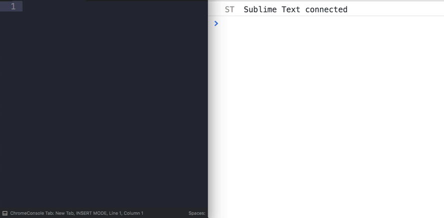

# Chrome Console

  

A SublimeText 3 Plugin to execute JavaScript code in Chrome, because Chrome isn't your text editor of choice.

Interact with your your running webapps! Live code your brains out!

## Installation

Via Package Control (easiest! 👍👍👍)

Alternatively, clone this repo into your  `Packages` directory. e.g. `~/Library/Application Support/Sublime Text 3/Packages/` on macOS.

## Starting Chrome

Chrome needs to be started with a special flag 🏳️🏳️🏳️ (`--remote-debugging-port`).

Don't worry, commands are provided to do this for you 😅.

1. If you haven't opened Chrome, use the `Chrome Console: Start Chrome` command.
2. If Chrome is already running, use `Chrome Console: Restart Chrome with remote debugging`*

>**this will quit and re-open Chrome, if you want to preserve your tabs, make sure you have set this behaviour in Chrome's settings: `On start-up: Continue where you left off`.*

## Usage

1. Start/Restart Chrome as above
2. Run the `Chrome Console: Connect to Tab` command
3. Select the tab you want to connect to
4. You should see `"Sublime Text connected"` in the Chrome Developer Tools console
5. Use <kbd>Shift</kbd> <kbd>Enter</kbd> in Sublime Text to execute JavaScript code:
    - If you have nothing selected it will execute the current line
    - With code selected it will execute just the selection

>Note: You can only be connected to one tab at a time, this is a Chrome limitation.

### Additional commands

- `Clear Console` <kbd>Cmd/Ctrl</kbd> <kbd>Shift</kbd> <kbd>C</kbd>
- `Reload Page` <kbd>Cmd/Ctrl</kbd> <kbd>Shift</kbd> <kbd>R</kbd>
- `Reload Page (Ignore Cache)` <kbd>Cmd/Ctrl</kbd> <kbd>Shift</kbd> <kbd>Alt</kbd> <kbd>R</kbd>
- `Open Developer Tools` *(will open in a new tab, Chrome does not allow you to open the built in Developer Tools window)*

## Settings

- 📁 Path to Chrome (can be Chrome, Canary, or Chromium)
- 🔧 Automatically opening the Developer Tools for every new window
- 🏳️ Additional chrome flags
- ⌨️ Enabling the [Command Line API](https://developers.google.com/web/tools/chrome-devtools/console/command-line-reference)
- 🏠 Custom hostname and port

## Thanks

The project was inspired by [SublimeWebInspector](https://github.com/sokolovstas/SublimeWebInspector/tree/master), but is far less ambitious, less opinionated, and hopefully easier to maintain.

This uses a *ever so slightly* modified version of [PyChromeDevTools](https://github.com/marty90/PyChromeDevTools).

## Author

Arthur Carabott - [arthurcarabott.com](https://arthurcarabott.com)
